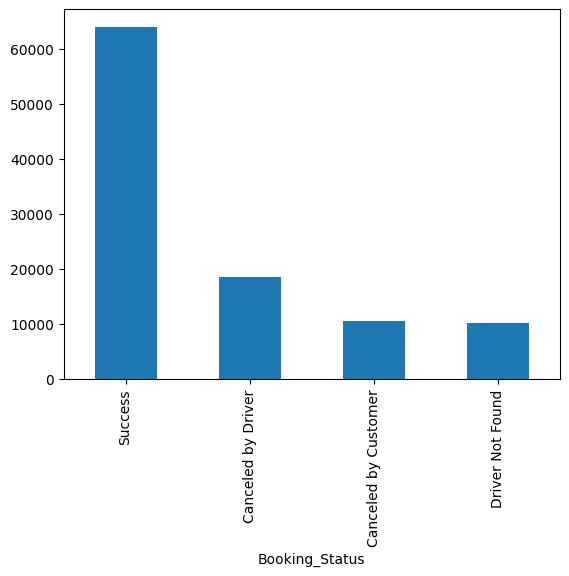
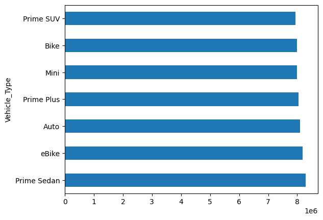
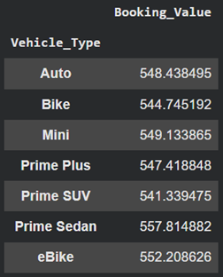
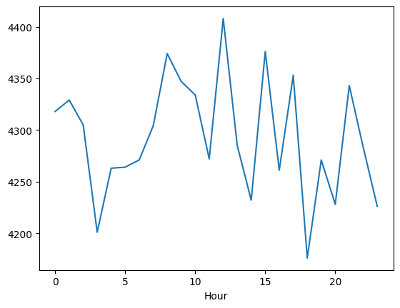
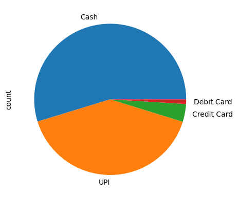

# Ola-Uber-EDA-pandas-matplotlib-Analysis

## 🚖 Project Overview
This project presents an **Exploratory Data Analysis (EDA)** of ride-booking data inspired by **Ola and Uber**, using **Python, Pandas, and Matplotlib in Google Colab** to uncover business insights, customer behavior patterns, and operational trends.

The analysis focuses on ride booking data to understand booking outcomes, revenue generation, vehicle performance, demand fluctuations, and payment preferences. This project demonstrates practical business intelligence and real-world data analytics techniques.

---

## 📂 Dataset Information
The dataset contains booking-related information such as:

- Booking ID
- Booking Status
- Vehicle Type
- Booking Value
- Hour
- Payment Method

Dataset loaded using Google Colab.

---

## 🛠 Tech Stack

- Python
- Pandas
- Matplotlib
- Google Colab
- CSV Dataset

---

## 📊 Analysis Performed

### Booking Status Distribution
Analyzed successful, cancelled, and incomplete bookings.

```python
df['Booking_Status'].value_counts().plot(kind='bar')
```



**Insight:** Helps identify operational efficiency and booking completion trends.

---

### Revenue Analysis
Analyzed revenue contribution by vehicle category.

```python
df.groupby('Vehicle_Type')['Booking_Value'].sum().sort_values(ascending=False).plot(kind='barh')
```



**Insight:** Identifies top revenue-generating vehicle types.

---

### Average Booking Value by Vehicle
Compared average booking values across vehicle segments.

```python
df.groupby('Vehicle_Type')['Booking_Value'].mean()
```



**Insight:** Shows which vehicle segments generate higher per-trip value.

---

### Demand by Hour
Analyzed hourly booking demand.

```python
df.groupby('Hour')['Booking_ID'].count().plot(title='Demand by Hour')
```



**Insight:** Helps identify peak customer booking hours.

---

### Payment Method Preference
Analyzed customer payment behavior.

```python
df['Payment_Method'].value_counts().plot(kind='pie', autopct='%1.1f%%')
```



**Insight:** Reveals preferred payment methods among users.

---

## 💻 Complete Python Code

```python
import pandas as pd
from pandas import read_csv
import matplotlib.pyplot as plt

# Load Dataset
df = read_csv('Bookings.csv')

# Preview Dataset
print(df.head())

# Dataset Information
print(df.info())

# Statistical Summary
print(df.describe())

# Booking Status Distribution
df['Booking_Status'].value_counts().plot(kind='bar', title='Booking Status Distribution')
plt.show()

# Revenue Analysis
df.groupby('Vehicle_Type')['Booking_Value'].sum().sort_values(ascending=False).plot(kind='barh', title='Revenue Analysis')
plt.show()

# Average Booking Value by Vehicle
print(df.groupby('Vehicle_Type')['Booking_Value'].mean())

# Demand by Hour
df.groupby('Hour')['Booking_ID'].count().plot(title='Demand by Hour')
plt.show()

# Payment Method Preference
df['Payment_Method'].value_counts().plot(kind='pie', autopct='%1.1f%%')
plt.show()
```

---

## 📌 Key Business Insights

- Booking success and cancellation patterns can be identified clearly.
- Revenue varies significantly by vehicle category.
- Some vehicle types generate higher average booking values.
- Peak demand hours indicate customer usage trends.
- Payment preferences provide customer behavior insights.

---

## 🚀 Skills Demonstrated

- Exploratory Data Analysis (EDA)
- Python Programming
- Pandas Data Manipulation
- Data Visualization
- Business Analytics
- Revenue Analysis
- Customer Behavior Analysis
- Statistical Analysis
- Data Storytelling

---

## 🔮 Future Improvements

- Interactive dashboard using Power BI / Tableau
- Demand forecasting using Machine Learning
- Ride cancellation prediction
- Customer segmentation analysis
- Geospatial hotspot analysis
- KPI monitoring dashboard

---

## ⭐ Project Objective

The objective of this project is to simulate how ride-sharing companies like **Ola and Uber** can leverage data analytics to improve operational efficiency, optimize pricing and business decisions, and enhance customer experience.

---

## 👨‍💻 Author

**Nikhil Chavan**  
B.Sc. Data Science Graduate | Data Analytics | Machine Learning | Python | SQL | AI Enthusiast
